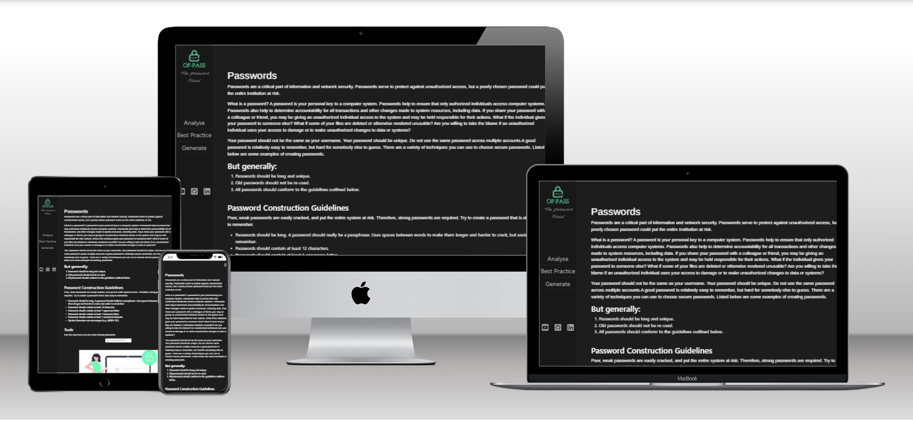
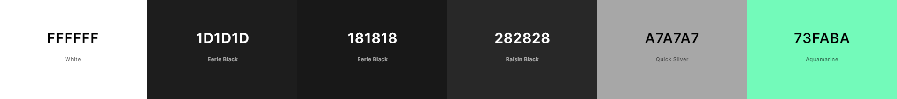
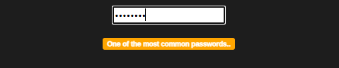
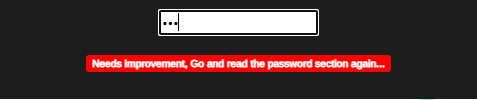
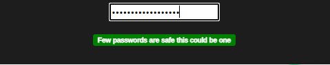
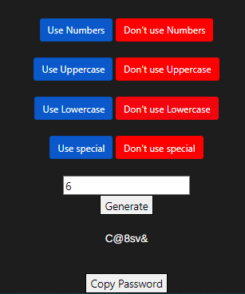
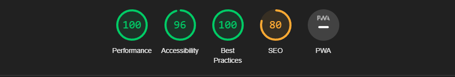
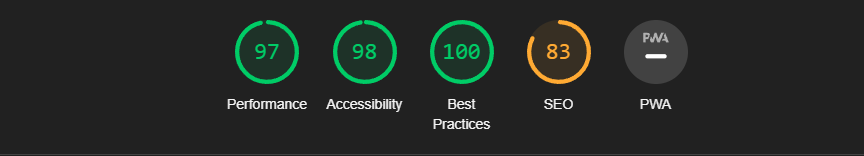
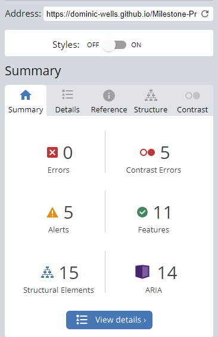

# Milestone-Project-2 OP-Pass

# OP-Pass

A interactive front-end site that responds to the users' actions, allowing users to actively engage with data, alter the way the site displays the information to achieve their preferred goals.

[--Live Site--](https://dominic-wells.github.io/Milestone-Project-2/)

# Table of Contents

1. [Introduction](#introduction)
2. [User Experience](#user-experience)
   - [User stories](#user-stories)
3. [Design](#design)
   - [Site theme](#Site-theme)
   - [Colour Scheme](#colour-scheme)
   - [Typography](#typography)
   - [Skeleton](#skeleton)
   - [Features](#Features)

# Introduction

This website has been developed to inform visitors of their password strength, password best practices and even generate a secure password on request.

This is my Second milestone project with the Code Institute on the Full Stack Web Devlopment Program the main aim is to produce a responsive website with an interactive front-end using JavaScript.

# User Experience

### Project Goals

- To incorporate javascript into html
- To produce an informative website
- To display easily accessible information

## User stories

- #### First Time Visitor Goals

1. As a first-time visitor, I want a tool to evaluate the strength of my password, so I know it's safe to use.

2. As a first-time visitor, I want the site to be easy to navigate, easy to understand and visually pleasing, so that I can find the information I need and have a pleasant experience whilst doing so.

3. As a First Time Visitor, I want to easily understand the main purpose of the site and learn more about password security, so I can make better security related decisions in the future.

4. As a First Time Visitor, I Would like to build a strong password.

- #### Returning Visitor Goals

1. As a returning visitor I want, to be able to connect the website delivery, so that I can ask any questions I may have.

2. As a returning visitor I want, to able to view other tools the developer might have made. so that I can explore other tools

3. As a returning visitor, I want to be able to able to generate my own secure password, so I don't have to think of one myself

[Back to top](#OP-Pass)

---

# Design

## Site theme

I wanted to avoid using visual effects that would be too distacting to users keeping the theme of minimalist aesthetics.

## Structure

The site site will be a "One Pager" will all the information the users will need on one page

## Colour Scheme

I wanted to use blacks and grays giving a nice contrast for readers.

## Typography

Arimo was used with a default backup as sans-serif.
I used 'Nothing You Could Do' with cursive to give the text under the logo a hand written look.

## Skeleton

I produced digital wireframes using Balsamiq.

When producing my wireframes, I decided to develop my ideas in stages, I attempted to improve my designs naturally by reviewing the wireframes after completion and finding areas of improvement.

I developed wireframes for different platforms, desktop, tablet and mobile where used.

Balsamiq wireframe Designs:

# Wireframes

A rough wireframe design in Balsamiq desktop style stage 1

A rough wireframe design in Balsamiq desktop style stage 2

 

A rough wireframe design in Balsamiq mobile style stage 1

A rough wireframe design in Balsamiq mobile style stage 2

 

A rough wireframe design in Balsamiq tablet style stage 1

## Features

-Fully responsive across a wide range of devices and systems 
-A sidenav with links to sections of the website 
-A password strengh tester 
-A password generator with copy button 

## Password Strengh Tester

Visitors can enter a password in the password textbox and they will receive a response to the password entered.

The response is based on the input entered passing a programming conditional statement using RegEx and commonly used passwords in a list using Javascript.

The above user entered a password that was on the common password list.

The above user entered a password that was found to be weak or unusable.

The above user entered a password that was found to be good.

## Password Generator

Visitors can generate a password based on button and text inputs.

Visitors can select what characters and length they wish their password to be.
The user inputs will be passed to an external API to [passwordwolf](https://passwordwolf.com/) The password is then displayed for the user. The user can also click a button to have the password copied

This is done by capturing user inputs from radio buttons and the text box, making them into variables to pass on the values to a URL then using the Fetch(Get) to receive the data and then display the password to the visitor

The above user quested a password that was 6 characters long and used upper,lower and special characters

## Testing

Code was manually tested by myself as I developed. I also used online tools such as JSHint, chromes Lighthouse, wave.webaim.org and W3C Markup Validator to determine if I missed anything.

